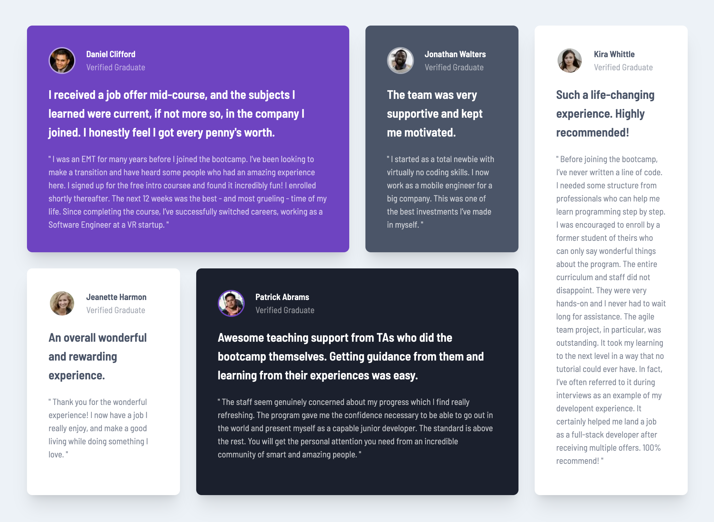

# Frontend Mentor - Testimonials grid section solution

This is a solution to the [Testimonials grid section challenge on Frontend Mentor](https://www.frontendmentor.io/challenges/testimonials-grid-section-Nnw6J7Un7). Frontend Mentor challenges help you improve your coding skills by building realistic projects. 

## Table of contents

- [Frontend Mentor - Testimonials grid section solution](#frontend-mentor---testimonials-grid-section-solution)
  - [Table of contents](#table-of-contents)
  - [Overview](#overview)
    - [The challenge](#the-challenge)
    - [Screenshot](#screenshot)
    - [Links](#links)
  - [My process](#my-process)
    - [Built with](#built-with)
    - [Useful resources](#useful-resources)
  - [Author](#author)

## Overview

### The challenge

Users should be able to:

- View the optimal layout depending on their device's screen size

### Screenshot

### Links

- Solution URL: [View on Frontend Mentor](https://www.frontendmentor.io/solutions/testimonials-grid-section-nextjstailwindtypescript-tvdTM4rKpX)
- Live Site URL: [View on Vercel](https://frontend-mentor-testimonials-grid-section-nick-abate.vercel.app/)

## My process

### Built with

- [React](https://reactjs.org/) - JS library
- [Next.js](https://nextjs.org/) - React framework
- [Tailwind CSS](https://tailwindcss.com/) - Utility-first CSS framework
- [TypeScript](https://www.typescriptlang.org/) - Strongly typed programming language that builds on JavaScript

### Useful resources

- [Tailwind cheatsheet](https://nerdcave.com/tailwind-cheat-sheet) - Quick reference for Tailwind class names.

## Author

- Portfolio - [Nick Abate](https://nickabate.dev/)
- Frontend Mentor - [@nickabate](https://www.frontendmentor.io/profile/nickabate)
- Twitter - [@thatdevnick](https://twitter.com/thatdevnick)

